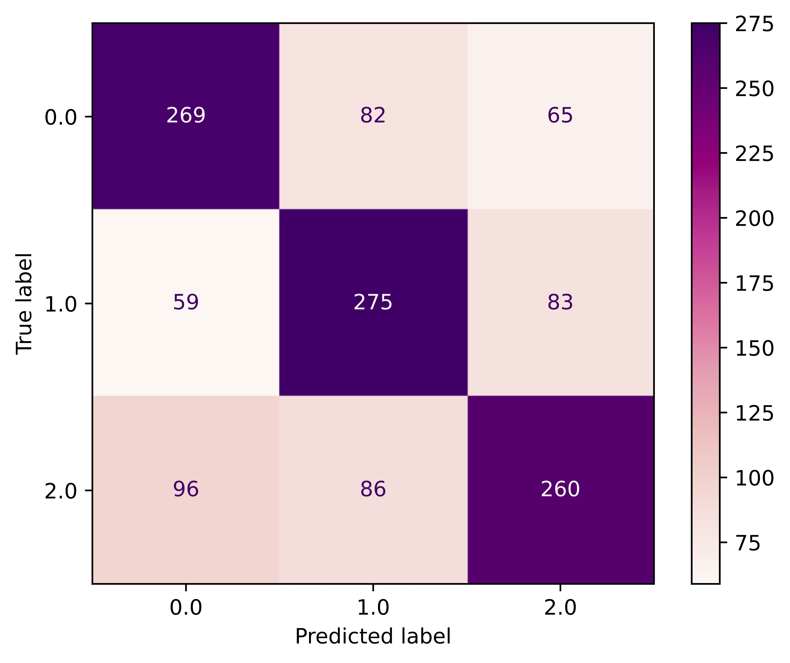
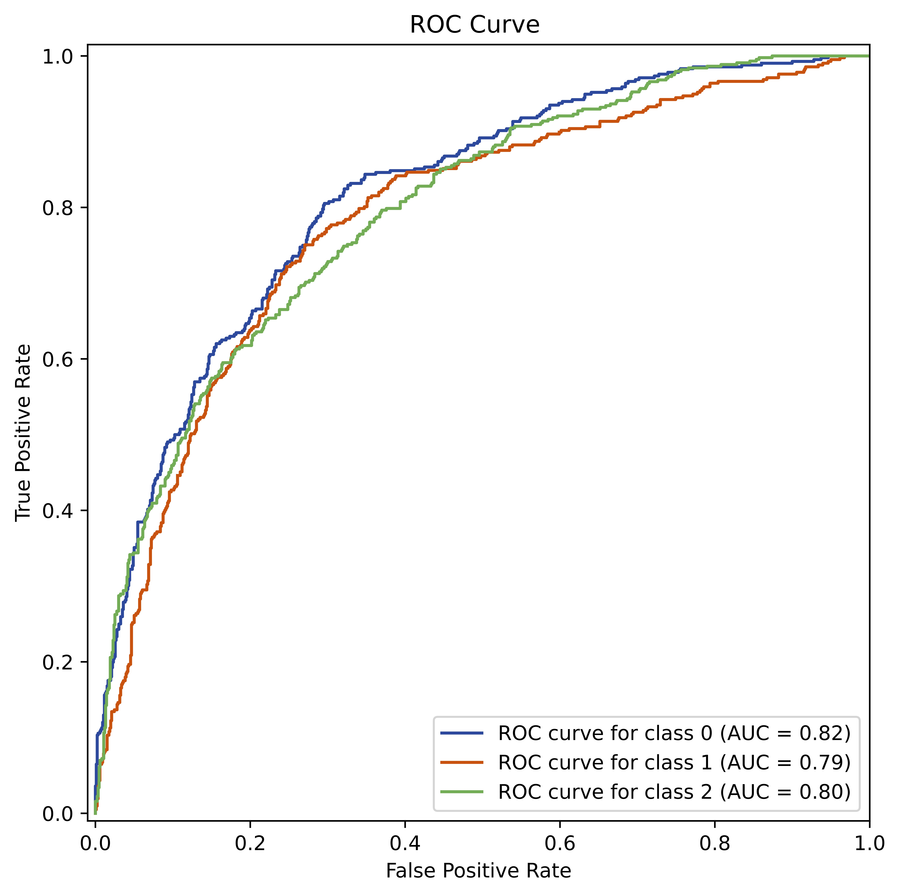
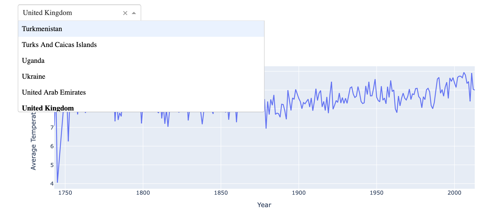
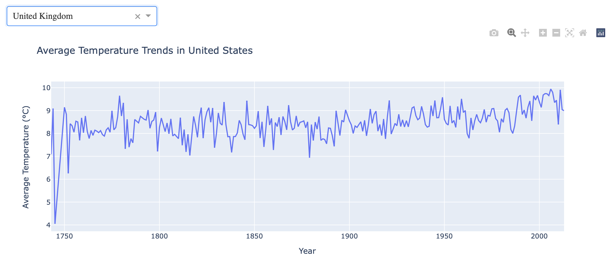
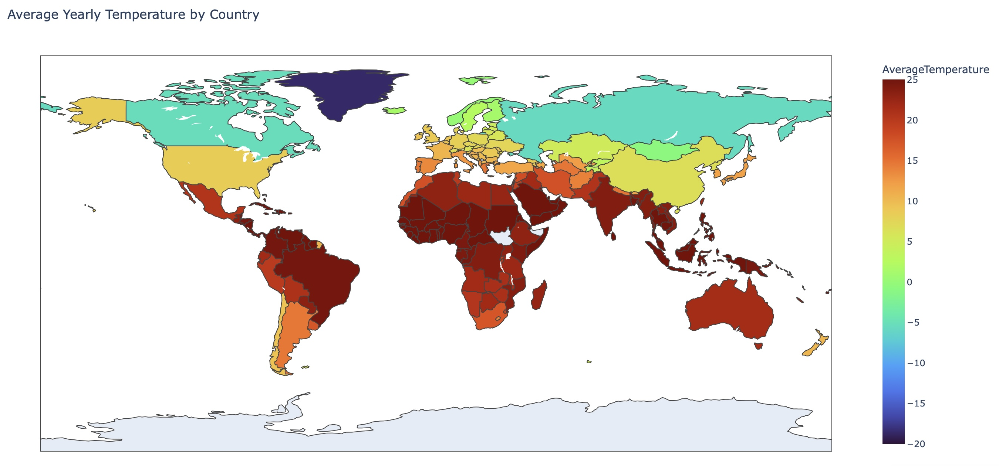
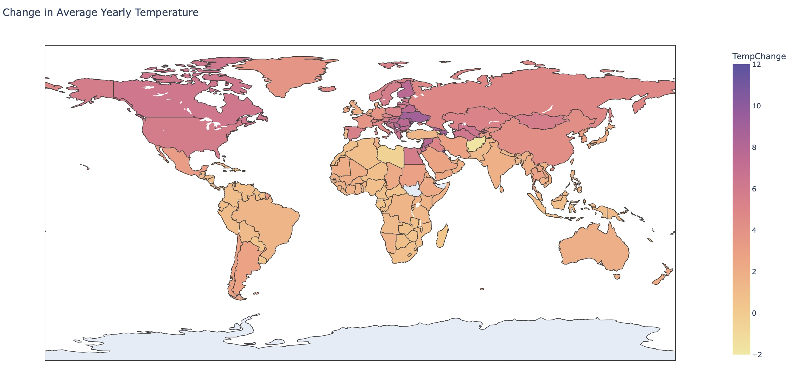
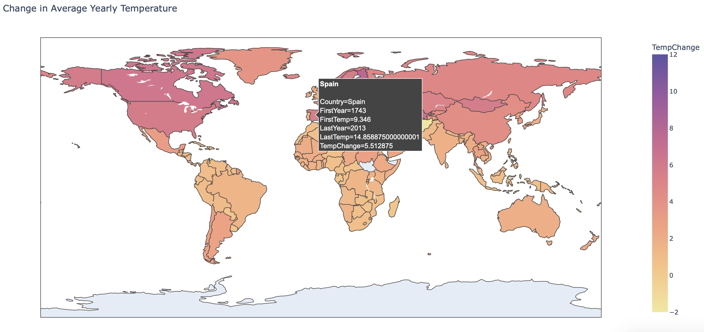

# Data Science Projects

Welcome to My [Data Science Projects Repository](https://github.com/martasframos/Data-Projects)
In this repository, you will find a collection of projects that reflect my journey as a data scientist, bridging the gap between research in astrophysics and practical applications. Here I showcase a variety of **data science applications and analyses** that demonstrate my expertise in **data manipulation**, **visualization**, and **machine learning**.

## What You Will Find Here:
**PhD Projects in Astrophysics:**
Explore my academic research where I used advanced data analysis techniques to investigate the evolution of galaxies. These projects highlight my ability to handle large datasets, apply statistical methodologies, and develop algorithms tailored to specific research questions within the field of astrophysics.

**Real-World Data Projects:**
In addition to my academic endeavors, I have undertaken projects that utilise real-world datasets to demonstrate how the skills and techniques I acquired during my PhD can be applied to address practical challenges.

## Table of Contents
- [Spectra of MaNGA galaxies](#computing-annulus-regions-in-maNGA-galaxies)
- [Global Temperature Data Dashboard](#global-temperature-data-dashboard)
---
## Computing Annulus Regions in MaNGA Galaxies
Date: 05/2022
### 1. Introduction
The MaNGA (Mapping Nearby Galaxies at Apache Point Observatory) survey has provided spatially resolved data for over 10,000 galaxies as part of the fourth generation of the Sloan Digital Sky Survey (SDSS). This type of data offers valuable insights into the physical processes governing galaxy formation and evolution. The [MaNGA data analysis pipeline](https://www.sdss4.org/dr17/manga/manga-analysis-pipeline/) (DAP) provides 2-D maps of various galaxy properties, such as Hα flux, D4000, and stellar velocity maps. The power of spatially resolved galaxy surveys lies in the ability to investigate different regions of the galaxy separately. Analyzing annulus regions within galaxies allows astronomers to study variations in stellar populations, gas dynamics, and chemical enrichment across different regions of the galaxy.

#### 1.1 Goal of This Project
The main objective of my project is to create distinct annular regions within galaxies to facilitate the extraction of their spectral data. Spectroscopy is a vital tool in astronomy, as it allows us to obtain critical information about galaxies, such as stellar mass, star formation rates, stellar ages, and metallicity.

In order to compute the radial profiles of galaxies, I first need to define and identify various annular regions around the galactic center. This involves determining which spaxels (the spatial pixels in a spectroscopic data cube) fall within each of these annulus regions. By accurately categorizing these spaxels, I can prepare for the systematic extraction of spectral data from each region in future analyses.

Here’s a brief overview of my approach:

**Region Definition:** I will establish clear criteria for defining the annular regions within the galaxy.

**Spaxel Identification:** I’ll develop algorithms to identify which spaxels lie within each of the defined annulus regions.

### 2. The Data

The data for this project will be sourced from the MaNGA public data release, specifically the SDSS DR17. The data is available in FITS format and can be downloaded from the [SDSS website](https://www.sdss4.org/dr17/manga/).

Each MaNGA datacube contains various properties that can be extracted, and the code presented here follows [this tutorial](https://www.sdss4.org/dr17/manga/manga-tutorials/how-do-i-look-at-my-data/python/) to obtain the necessary properties.

The galaxy used in this example has plateifu = 8548-12701 and its H-alpha map is shown below:

### Results

The code shown in [this notebook](./MaNGA_Annulus_region/Annulus_region_illustration.ipynb) creates several annulus regions inside of the galaxy map, with each of the regions having a certain number of spaxesl, which are only counted once. An illustration of thes regions is presented below:

The creation of annular regions was successful, and the results demonstrate the potential for spectral extraction and stacking. One challenge I encountered was ensuring that the criteria for defining the annuli accurately reflected the galaxy's physical structure (i.e. taking the size and axis ratio into consideration). However, through iterative refinement, I improved the algorithm's accuracy.

#### Technologies Used
- Python
- Pandas
- NumPy
- Astropy
- Matplotlib
- FITS (Flexible Image Transport System)
---
## Predicting Galaxy Gradients with Machine Learning 

### 1. Introduction

In this study, I analyze the stacked spectra of galaxies within defined annular regions. Using a spectral energy distribution (SED) fitting model, I derive critical astrophysical parameters such as stellar mass, specific star formation rate (sSFR), age, and metallicity. These parameters are then plotted as functions of the distance from the center of the galaxy, with the property values represented on the y-axis and the normalized distance `r/R_e` on the x-axis, where `R_e` denotes the effective radius of the galaxy.

This spatial analysis allows us to explore the distribution of sSFR gradients across different regions of galaxies. Subsequently, we apply machine learning techniques to investigate the relationships between these derived properties and other galaxy characteristics—including color, Sérsic Index, and more—to identify which features are the most predictive of sSFR gradients.

### 2. Analysis 

The sSFR gradients are categorized into three distinct classes based on their slope characteristics:

**Negative Gradient:** Indicates a decrease in sSFR as the distance from the galaxy center increases.
**Shallow Gradient:** Represents a minimal change in sSFR across the annulus regions.
**Positive Gradient:** Suggests an increase in sSFR as one moves outward from the center of the galaxy.
To classify these gradients, I utilise **Random Forest Classification**, a robust ensemble learning method that excels at handling complex interactions between variables and is less prone to overfitting. This model enables us to assign galaxies to one of the three categories based on various predictive features, including color and Sérsic Index.

**Feature Importance**
After training the model, we assess **feature importance** to identify which characteristics most significantly influence the classification of sSFR gradients. Understanding these predictive features is essential for gaining insights into the physical processes that govern star formation within galaxies.

**Model Evaluation**
We employ several metrics to evaluate the performance of our classification model:

**Confusion Matrix:** This matrix provides a detailed overview of the model's predictions, illustrating true positives, true negatives, false positives, and false negatives.
**ROC Curve:** The Receiver Operating Characteristic (ROC) curve depicts the balance between sensitivity (true positive rate) and specificity (false positive rate) across different threshold settings.
**Accuracy:** While accuracy serves as a general measure of model performance, it can sometimes be misleading in the context of imbalanced class distributions. Thus, we complement accuracy with the confusion matrix and ROC curve analysis to ensure a comprehensive evaluation.
Through this analysis, I aim to uncover the galaxy properties that are most predictive of sSFR gradients, contributing to our understanding of galaxy evolution and the underlying mechanisms of star formation.

### 3. Results

In  I provide the code used to train and fit the data. I perform a gridsearch cross validation with 5 folds to find the best fitting hyperparatemeters. The ranges explored here are quite small, sicne I found in a prelimenary analysis that the increase in performance was very small (+ 0.2 in accuracy) with the computation time of the search being over 10 times the one presented here. For this reason, in the interes of efficient computing, I show a small grid search. 

In [this notebook](https://github.com/martasframos/Data-Projects/blob/main/Galaxy_gradients/sSFR_gradients.ipynb), I provide the code used to train and fit the model on the dataset. I perform a **Grid Search Cross-Validation** with 5 folds to identify the best-fitting hyperparameters for the model.

**Hyperparameter Tuning**
The ranges explored for the hyperparameters are relatively small. This decision stems from preliminary analyses, which indicated that increasing the hyperparameter ranges yielded only marginal improvements in model performance (approximately +0.2 in accuracy). However, the computational time required for a broader search was significantly higher—over ten times greater than the current configuration.

**Rationale for a Smaller Grid Search**
Given the trade-off between computational efficiency and performance gains, I opted to conduct a more focused grid search. This approach ensures that the model training process remains efficient without sacrificing significant predictive performance. The results obtained from this smaller grid search will serve as a reliable foundation for understanding the model's behavior and guiding future optimization efforts.

After fitting the model, the accuracy achieved was **0.63**. Below are additional performance evaluations that further illustrate the model's effectiveness.

**Confusion Matrix**
The confusion matrix provides insight into the classification results. Notably, class 0 (negative gradient) has the least proportion of misclassifications, indicating a relatively high level of accuracy in predicting this class.

**ROC Curve**
The Receiver Operating Characteristic (ROC) curve visualizes the trade-off between sensitivity (true positive rate) and specificity (false positive rate) at various threshold settings. This curve is essential for understanding the model's performance across different classification thresholds.

To enhance our understanding of the model's predictions, I analysed the feature importance scores derived from the Random Forest classifier. These scores indicate which properties are the most predictive of the specific star formation rate (sSFR) gradients.

**Importance of Features**
The following table presents the importance scores for each feature:

---
## Data Analysis Report on the Iris Dataset
Date: 07/2024

### 1. Introduction
As I embarked on my journey into the world of data science during my Ph.D., one of my goals was to apply the analytical skills I acquired in real-world contexts. A perfect opportunity to demonstrate this came with the Iris dataset, a classic in the fields of machine learning and statistics. This dataset contains 150 samples of iris flowers, characterized by four features: sepal length, sepal width, petal length, and petal width. Each flower belongs to one of three species: Setosa, Versicolor, or Virginica.

My motivation for analyzing this dataset was twofold: to explore the relationships among its features and to showcase the data science techniques I’ve learned. I wanted to highlight how these skills can be applied effectively to solve practical problems.

#### 1.1 Motivation
This analysis is not just about crunching numbers; it’s about uncovering insights and building models that can help us understand and classify species based on their characteristics. By working through this dataset, I aimed to demonstrate my grasp of various data science methodologies, including visualization, clustering, classification, and statistical testing. My hope was to illustrate the versatility of these techniques and their relevance to real-world applications.

### 2 Data and analysis
The data used here is publicly available at the [UCI Machine Learning Repository](https://archive.ics.uci.edu/dataset/53/iris).
The Iris dataset is a widely used benchmark dataset in machine learning and data analysis. It contains measurements of iris flowers across three species, enabling us to explore various features and relationships within the data.

**Features**
- Sepal Length: Length of the sepal in centimeters.
- Sepal Width: Width of the sepal in centimeters.
- Petal Length: Length of the petal in centimeters.
- Petal Width: Width of the petal in centimeters.
- Species: Categorical variable indicating the species of iris flowers (Setosa, Versicolor, Virginica).

#### 2.1 Analysis
In this analysis, I performed the following steps:

**Data exploration and visualization** of feature relationships and species distribution.
**Clustering with K-Means** to uncover patterns and groupings within the data.
**Dimensionality reduction using PCA and t-SNE** to visualize the data in 2D space.

##### 2.1.1. Data Exploration and Visualization:
The first step of the analysis was to visualize the relationships between different features and species. Using Seaborn's pairplot, I examined the pairwise relationships between the features, segmented by species. The plot demonstrated clear separations between the setosa species and the other two, especially when considering petal length and petal width.

Additionally, I created a correlation heatmap to assess the linear relationships between the features. This revealed that petal length and petal width had the strongest positive correlation, highlighting their significance in distinguishing between species.

Key observations:

Petal features (length and width) show stronger correlations with species than sepal features.
The setosa species is distinctly separated from versicolor and virginica.

##### 2.1.2. Clustering with K-Means:
To explore the natural groupings within the dataset, I applied K-Means clustering with three clusters (representing the three species). The clustering was visualized through a scatter plot based on sepal length and sepal width, colored by the cluster assignment.

I evaluated the clustering using the silhouette score, which measured how well-separated the clusters were. The silhouette score for K-Means clustering was 0.55, indicating moderately well-defined clusters.

Key insights:

K-Means clustering reasonably grouped the data, although versicolor and virginica showed some overlap.
The model successfully identified setosa as a distinct cluster.

##### 2.1.3. Dimensionality Reduction with PCA and t-SNE:
Next, I performed Principal Component Analysis (PCA) to reduce the dataset’s dimensionality and visualize it in a two-dimensional space. PCA identified the two most important components that accounted for a significant portion of the variance in the dataset.

Through PCA, the species were visualized in 2D, with setosa distinctly separated. However, the overlap between versicolor and virginica persisted.

To complement PCA, I applied t-Distributed Stochastic Neighbor Embedding (t-SNE), a nonlinear dimensionality reduction technique, to capture complex relationships between the samples. The t-SNE visualization revealed a more nuanced separation between the species, though some overlap remained.

Key findings:

PCA provided a quick way to identify the most important features.
t-SNE offered a more intricate view of how species relate to each other in multidimensional space.

## Global Temperature Data Dashboard
Date: 09/2024
### 1. Project Overview
This project provides an interactive dashboard to visualize global temperature changes over time using data from the Global Land Temperatures dataset. The dashboard allows users to explore average yearly temperatures by country and observe changes in temperature over the years. 

#### 1.1 Project Features
This project includes:
- A choropleth map displaying average yearly temperatures by country.
- A choropleth map visualizing the change in average temperature over time.
- A line chart that shows the historical temperature trends for individual countries.

Built using **Dash** and **Plotly**, this dashboard facilitates interactive visualization of climate data, making it easier to track changes over time and across regions.

### 2. Project Purpose
The primary goal of this project is to create a visually appealing and informative dashboard that allows users to analyze temperature trends across different countries. It aims to highlight the impact of climate change by showcasing average temperature changes from the first recorded year to the most recent year.

#### Dataset
The project uses the Global Land Temperatures by Country dataset, which contains historical temperature data collected from various countries.

#### 3. Features
- **Interactive Dropdown**: Users can select a country to visualize its average temperature trends over the years.
- **Choropleth Maps**:
  - A map displaying the average yearly temperature for each country.
  - A map showing the change in average yearly temperature from the first to the last recorded year, with hover information that includes:
    - First and last year of data
    - Average temperatures for those years
- **Line Chart**: A line chart visualizing the temperature trend for the selected country.

The code is provided in [this notebook](https://github.com/martasframos/Data-Projects/blob/main/Data_visualisation_dashboard/Data_visualisation_dashboard.ipynb) and the outputs are presented below:

1- Dropdown menu to select which country to look at the average yearly temperature

2- The average temperature map with ability to hover over a desired country

3- The map showing the change in the average yearly temperature. Can also hover over any country.

#### Technologies Used
- Python
- Dash
- Plotly
- Pandas
- Jupyter Notebook (for development)
- HTML/CSS (for basic styling)

### Future Improvements
Incorporate additional data sources for more comprehensive analysis (e.g., CO2 emissions).
Add more interactive features, such as filtering by year range.
Enhance the design and usability of the dashboard.
Include options to download the displayed data or graphs.

