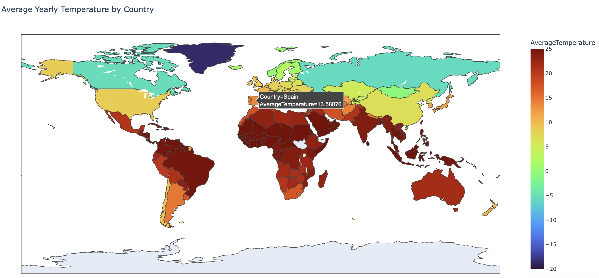

# Data Science Projects
This repository showcases a variety of **data science applications and analyses** that demonstrate my expertise in **data manipulation**, **visualization**, and **machine learning**. These projects range from work I completed as part of my **PhD in Astrophysics** to additional projects aimed at solving real-world problems and enhancing my data science skills.

## Table of Contents
- [What You Will Find](#what-you-will-find)
- [Spectra of MaNGA galaxies](#computing-annulus-regions-in-maNGA-galaxies)
- [Global Temperature Data Dashboard](#global-temperature-data-dashboard)

## What You'll Find:

#### PhD Projects
Research-focused projects that leverage data science techniques in the context of astrophysics. These projects highlight advanced methods in:

- **Getting spectra from MaNGA galaxies**
- **Using Machine Learning to predict galaxy gradients**
- **Correcting double peaks in emission lines of stacked spectra**

#### Real-World Projects
Independent projects designed to explore various domains of data science. These include:

- **Data visualizations using tools like Plotly and Dash**
- **Solving practical problems in areas such as climate science, finance, and more**

## Computing Annulus Regions in MaNGA Galaxies

### 1. Introduction
The MaNGA (Mapping Nearby Galaxies at Apache Point Observatory) survey has provided spatially resolved data for over 10,000 galaxies as part of the fourth generation of the Sloan Digital Sky Survey (SDSS). This type of data offers valuable insights into the physical processes governing galaxy formation and evolution. The [MaNGA data analysis pipeline](https://www.sdss4.org/dr17/manga/manga-analysis-pipeline/) (DAP) provides 2-D maps of various galaxy properties, such as Hα flux, D4000, and stellar velocity maps. The power of spatially resolved galaxy surveys lies in the ability to investigate different regions of the galaxy separately. Analyzing annulus regions within galaxies allows astronomers to study variations in stellar populations, gas dynamics, and chemical enrichment across different regions of the galaxy.

#### 1.1 Goal of This Project
The main goal of this project is to compute annulus regions within MaNGA galaxies, compute the stacked spectra within those regions, and investigate the radial profiles of different galaxy properties.

### 2. The Data

#### 2.1 Data Source
The data for this project will be sourced from the MaNGA public data release, specifically the SDSS DR17. The data is available in FITS format and can be downloaded from the [SDSS website](https://www.sdss4.org/dr17/manga/).

Each MaNGA datacube contains various properties that can be extracted, and the code presented here follows [this tutorial](https://www.sdss4.org/dr17/manga/manga-tutorials/how-do-i-look-at-my-data/python/) to obtain the necessary properties.

The galaxy used in this example has plateifu = 8548-12701 and its H-alpha map is shown below:

The code shown in [this notebook](./MaNGA_Annulus_region/Annulus_region_illustration.ipynb) creates several annulus regions inside of the galaxy map, with each of the regions having a certain number of spaxesl, which are only counted once. An illustration of thes regions is presented below:

#### Technologies Used
- Python
- Pandas
- NumPy
- Astropy
- Matplotlib
- FITS (Flexible Image Transport System)

---

## Global Temperature Data Dashboard

### 1. Project Overview
This project provides an interactive dashboard to visualize global temperature changes over time using data from the Global Land Temperatures dataset. The dashboard allows users to explore average yearly temperatures by country and observe changes in temperature over the years. 

#### 1.1 Project Features
This project includes:
- A choropleth map displaying average yearly temperatures by country.
- A choropleth map visualizing the change in average temperature over time.
- A line chart that shows the historical temperature trends for individual countries.

Built using **Dash** and **Plotly**, this dashboard facilitates interactive visualization of climate data, making it easier to track changes over time and across regions.

### 2. Project Purpose
The primary goal of this project is to create a visually appealing and informative dashboard that allows users to analyze temperature trends across different countries. It aims to highlight the impact of climate change by showcasing average temperature changes from the first recorded year to the most recent year.

#### Technologies Used
- Python
- Dash
- Plotly
- Pandas
- Jupyter Notebook (for development)
- HTML/CSS (for basic styling)

#### Dataset
The project uses the Global Land Temperatures by Country dataset, which contains historical temperature data collected from various countries.

#### 3. Features
- **Interactive Dropdown**: Users can select a country to visualize its average temperature trends over the years.
- **Choropleth Maps**:
  - A map displaying the average yearly temperature for each country.
  - A map showing the change in average yearly temperature from the first to the last recorded year, with hover information that includes:
    - First and last year of data
    - Average temperatures for those years
- **Line Chart**: A line chart visualizing the temperature trend for the selected country.

The average temperature map output is shown below:

The map showing the change in the average yearly temperature looks like this:

### Future Improvements
Incorporate additional data sources for more comprehensive analysis (e.g., CO2 emissions).
Add more interactive features, such as filtering by year range.
Enhance the design and usability of the dashboard.
Include options to download the displayed data or graphs.

