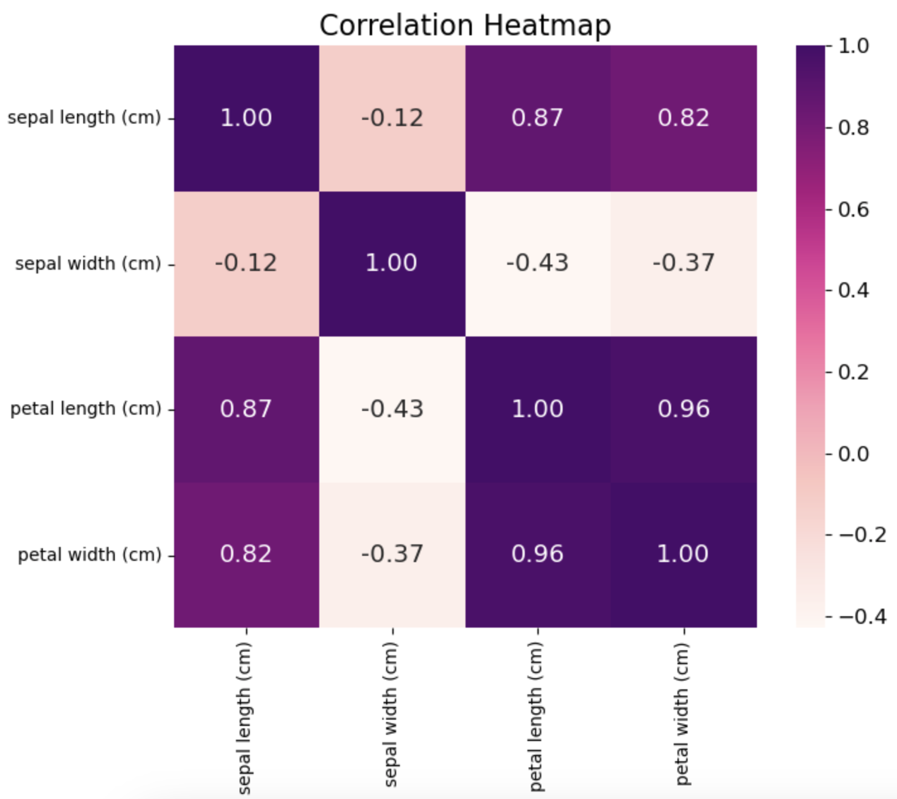

Hi, I'm Marta! I am a data science enthusiast with a background in Astrophysics and experience in analysing medical data. I’m passionate about using data to solve real-world problems and uncover insights. My goal is to leverage my skills in data analysis, machine learning, and data visualization to facilitate data-driven decisions that positively impact businesses and communities. I believe in the transformative power of data and am excited to contribute to innovative solutions across diverse fields.
# Data Science Projects

Welcome to My [Data Science Projects Repository](https://github.com/martasframos/Data-Projects)
In this repository, you will find a collection of projects that reflect my journey as a data scientist, bridging the gap between research in astrophysics and practical applications. Here I showcase a variety of **data science applications and analyses** that demonstrate my expertise in **data manipulation**, **visualization**, and **machine learning**.

## What You Will Find Here:
**PhD Projects in Astrophysics:**
Explore my academic research where I used advanced data analysis techniques to investigate the evolution of galaxies. These projects highlight my ability to handle large datasets, apply statistical methodologies, and develop algorithms tailored to specific research questions within the field of astrophysics.

**Real-World Data Projects:**
In addition to my academic endeavours, I have undertaken projects that utilise real-world datasets to demonstrate how the skills and techniques I acquired during my PhD can be applied to address practical challenges.

## Table of Contents
- [Spectra of MaNGA galaxies](#computing-annulus-regions-in-maNGA-galaxies)
- [Machine Learning to Predict Galaxy Gradients](#predicting-galaxy-gradients-with-machine-learning )
- [Analysis of the Iris Dataset](#data-analysis-report-on-the-iris-dataset)
- [Global Temperature Data Dashboard](#global-temperature-data-dashboard)

---
## Computing Annulus Regions in MaNGA Galaxies
Date: 05/2022
### 1. Introduction
The MaNGA (Mapping Nearby Galaxies at Apache Point Observatory) survey has provided spatially resolved data for over 10,000 galaxies as part of the fourth generation of the Sloan Digital Sky Survey (SDSS). This type of data offers valuable insights into the physical processes governing galaxy formation and evolution. The [MaNGA data analysis pipeline](https://www.sdss4.org/dr17/manga/manga-analysis-pipeline/) (DAP) offers 2-D maps of various galaxy properties, including Hα flux, D4000, and stellar velocity maps. The power of spatially resolved galaxy surveys lies in the ability to investigate different regions of the galaxy separately.

By analysing annulus regions within galaxies, astronomers can study variations in stellar populations, gas dynamics, and chemical enrichment across different parts of the galaxy.

#### 1.1 Goal of This Project
The main objective of this project is to create distinct annular regions within galaxies to facilitate the extraction of their spectral data. Spectroscopy is a vital tool in astronomy, providing critical information about galaxies, such as stellar mass, star formation rates, stellar ages, and metallicity.

To compute the radial profiles of galaxies, I first need to define and identify various annular regions around the galactic centre. This involves determining which spaxels (the spatial pixels in a spectroscopic data cube) fall within each of these annular regions. By accurately categorizing these spaxels, I can prepare for the systematic extraction of spectral data from each region in future analyses.

Here’s a brief overview of my approach:

- **Region Definition:** Establish clear criteria for defining the annular regions within the galaxy.
- **Spaxel Identification:** Develop algorithms to identify which spaxels lie within each of the defined annulus regions.

### 2. The Data

The data for this project will be sourced from the MaNGA public data release, specifically the SDSS DR17. The data is available in FITS format and can be downloaded from the [SDSS website](https://www.sdss4.org/dr17/manga/).

Each MaNGA datacube contains various properties that can be extracted, and the code presented here follows [this tutorial](https://www.sdss4.org/dr17/manga/manga-tutorials/how-do-i-look-at-my-data/python/) to obtain the necessary properties.

The galaxy used in this example has plateifu = 8548-12701 and its H-alpha map is shown below:

### Results

The code shown in [this notebook](./MaNGA_Annulus_region/Annulus_region_illustration.ipynb) creates several annular regions inside the galaxy map, with each of the regions encompassing a specific number of spaxels, counted only once. An illustration of these regions is presented below:

The creation of annular regions was successful, demonstrating the potential for spectral extraction and stacking. One challenge encountered was ensuring that the criteria for defining the annuli accurately reflected the galaxy's physical structure (i.e., taking size and axis ratio into consideration). However, through iterative refinement, the algorithm's accuracy was improved.

#### Technologies Used
- Python
- Pandas
- NumPy
- Astropy
- Matplotlib
- FITS (Flexible Image Transport System)
---
## Predicting Galaxy Gradients with Machine Learning 
Dat2 01/2024
### 1. Introduction

In this study, I analyse the stacked spectra of galaxies within defined annular regions. Using a spectral energy distribution (SED) fitting model, I derive critical astrophysical parameters such as stellar mass, specific star formation rate (sSFR), age, and metallicity. These parameters are then plotted as functions of the distance from the centre of the galaxy, with the property values represented on the y-axis and the distance to the centre in unites of `r/R_e` on the x-axis, where `R_e` denotes the effective radius of the galaxy.

This spatial analysis allows us to explore the distribution of sSFR gradients across different regions of galaxies. Subsequently, I apply machine learning techniques to investigate the relationships between these derived properties and other galaxy characteristics—including colour, Sérsic Index, and more—to identify which features are the most predictive of sSFR gradients.

### 2. Analysis 

The sSFR gradients are categorized into three distinct classes based on their slope characteristics:

**Negative Gradient:** Indicates a decrease in sSFR as the distance from the galaxy centre  increases.

**Shallow Gradient:** Represents a minimal change in sSFR across the annulus regions.

**Positive Gradient:** Suggests an increase in sSFR as one moves outward from the centre  of the galaxy.

To classify these gradients, I utilise **Random Forest Classification**, a robust ensemble learning method that excels at handling complex interactions between variables and is less prone to overfitting. This model enables us to assign galaxies to one of the three categories based on various predictive features, including colour and Sérsic Index.

**Feature Importance**
After training the model, I assess **feature importance** to identify which characteristics most significantly influence the classification of sSFR gradients. Understanding these predictive features is essential for gaining insights into the physical processes that govern star formation within galaxies.

**Model Evaluation**
I employ several metrics to evaluate the performance of our classification model:

**Confusion Matrix:** This matrix provides a detailed overview of the model's predictions, illustrating true positives, true negatives, false positives, and false negatives.

**ROC Curve:** The Receiver Operating Characteristic (ROC) curve depicts the balance between sensitivity (true positive rate) and specificity (false positive rate) across different threshold settings.

**Accuracy:** While accuracy serves as a general measure of model performance, it can sometimes be misleading in the context of imbalanced class distributions. Thus, I complement accuracy with the confusion matrix and ROC curve analysis to ensure a comprehensive evaluation.

Through this analysis, I aim to uncover the galaxy properties that are most predictive of sSFR gradients, contributing to our understanding of galaxy evolution and the underlying mechanisms of star formation.

### 3. Results

In [this notebook](https://github.com/martasframos/Data-Projects/blob/main/Galaxy_gradients/sSFR_gradients.ipynb), I provide the code used to train and fit the model on the dataset. I perform a **Grid Search Cross-Validation** with 5 folds to identify the best-fitting hyperparameters for the model.

**Hyperparameter Tuning**
The ranges explored for the hyperparameters are relatively small. This decision stems from preliminary analyses, which indicated that increasing the hyperparameter ranges yielded only marginal improvements in model performance (approximately +0.2 in accuracy). However, the computational time required for a broader search was significantly higher—over ten times greater than the current configuration.

**Rationale for a Smaller Grid Search**
Given the trade-off between computational efficiency and performance gains, I opted to conduct a more focused grid search. This approach ensures that the model training process remains efficient without sacrificing significant predictive performance. The results obtained from this smaller grid search will serve as a reliable foundation for understanding the model's behaviour and guiding future optimization efforts.

After fitting the model, the accuracy achieved was **0.63**. Below are additional performance evaluations that further illustrate the model's effectiveness.

**Confusion Matrix**
The confusion matrix provides insight into the classification results. Notably, class 0 (negative gradient) has the least proportion of misclassifications, indicating a relatively high level of accuracy in predicting this class.

**ROC Curve**
The Receiver Operating Characteristic (ROC) curve visualizes the trade-off between sensitivity (true positive rate) and specificity (false positive rate) at various threshold settings. This curve is essential for understanding the model's performance across different classification thresholds.

To enhance our understanding of the model's predictions, I analysed the feature importance scores derived from the Random Forest classifier. These scores indicate which properties are the most predictive of the specific star formation rate (sSFR) gradients.

**Feature Importance vs. Permutation Importance**

After training the model, I assess **feature importance** to identify which features most significantly influence the classification of sSFR gradients. Feature importance computed by the Random Forest model provides a direct insight into which features the model relies on during training. This method evaluates how much each feature decreases the weighted impurity (e.g., Gini impurity or entropy) at each split of a decision tree, averaged over all trees in the forest.

However, **permutation importance** offers an alternative approach that better captures the impact of each feature in a model-agnostic way. Rather than relying on the internal structure of the model, permutation importance measures the decrease in the model’s performance when the values of a feature are randomly shuffled, thereby breaking its relationship with the target variable. This method provides a more reliable and unbiased estimate of feature importance.

**Why Use Permutation Importance?**

**1- Model-Agnostic:** Permutation importance can be applied to any model (not just tree-based models like Random Forest), making it more versatile.

**2- Captures Interactions:** Unlike the built-in feature importance in Random Forest, permutation importance can capture complex interactions between features by measuring how sensitive the model is to changes in each feature. It is a measure of how much the performance of the model (in this case the AUC) decrease when a feature is randomly shuffled. This means that permutation importance scores show the change in accuracy.

**3- Considers Overfitting:** Random Forest feature importance can sometimes be biased towards high cardinality features (those with many unique values), while permutation importance is less prone to such biases because it’s directly tied to the model’s performance.

**4- Considers Testing Data:** Permutation importance is usually calculated on unseen testing data, offering a better reflection of how features contribute to generalization rather than just model training.

**Drawbacks of Permutation Importance**

**1- Computation Time:** It can be computationally expensive, especially when working with large datasets, as it requires repeated evaluations of the model on perturbed data.

**2- Correlation Sensitivity:** If two features are highly correlated, permutation importance can underestimate their importance because shuffling one may not fully break its relationship with the target variable (the correlated feature still contains similar information).

The feature importance score is shown bellow:

As shown in the notebook, the permutation importance shows a different ranking:
**Permutation Importance**

| Feature           | Importance Score |
|-------------------|------------------|
| sSFR              | 0.213            |
| Sérsic Index      | 0.066            |
| color_g_r         | 0.066            |
| color_g_i         | 0.035            |
| Re_kpc            | 0.032            |
| Mass              | 0.019            |
| Metallicity       | 0.019            |
| Redshift          | 0.012            |
| Log_surf_density  | 0.008            |

Here, sSFR, Sérsic Index and g-r colour being the top 3 features that are most predictive of the sSFR gradient. 

**Why trust permutation importance over feature importance?**

**1- Performance-Based Evaluation:** Permutation importance is based on actual model performance—it measures how much the model's accuracy or any other performance metric (like AUC or F1 score) degrades when a feature's values are randomly shuffled. This is a strong justification because the importance is tied to how much each feature directly contributes to the model's predictions, as opposed to only looking at how the model is built (as with Random Forest's internal feature importance).

**2- Overcomes Model Biases:** Random Forest’s feature importance can be biased towards high-cardinality features (those with many unique values), or toward features that split early in decision trees. For example, features that appear in many nodes across multiple trees may have artificially high importance, even if they aren't crucial for making accurate predictions. Permutation importance eliminates this bias because it tests feature importance by directly disrupting the feature’s predictive relationship with the target variable.

### Conclusions
In this work, I concluded that the sSFR in the central region of the galaxy, together with its Sérsic Index and g-r colour are the features that play the most significant role in predicting the sSFR gradient in galaxies. 
#### Technologies Used
- Python
- Pandas
- NumPy
- Seaborn
- scikit-learn
- Random Forest
- GridSearchCV
- Feature Importance Analysis
- Cross-Validation
  
---
## Data Analysis Report on the Iris Dataset
Date: 07/2024

### 1. Introduction
As I embarked on my journey into the world of data science during my Ph.D., one of my goals was to apply the analytical skills I acquired in real-world contexts. A perfect opportunity to demonstrate this came with the Iris dataset, a classic in the fields of machine learning and statistics. This dataset contains 150 samples of iris flowers, characterized by four features: sepal length, sepal width, petal length, and petal width. Each flower belongs to one of three species: Setosa, Versicolor, or Virginica.

My motivation for analysing this dataset was twofold: to explore the relationships among its features and to showcase the data science techniques I’ve learned. I wanted to highlight how these skills can be applied effectively to solve practical problems.

#### 1.1 Motivation
This analysis is not just about crunching numbers; it’s about uncovering insights and building models that can help us understand and classify species based on their characteristics. By working through this dataset, I aimed to demonstrate my grasp of various data science methodologies, including visualization, clustering, classification, and statistical testing. My hope was to illustrate the versatility of these techniques and their relevance to real-world applications.

### 2 Data and analysis
The data used here is publicly available at the [UCI Machine Learning Repository](https://archive.ics.uci.edu/dataset/53/iris).
The Iris dataset is a widely used benchmark dataset in machine learning and data analysis. It contains measurements of iris flowers across three species, enabling us to explore various features and relationships within the data.

**Features**
- Sepal Length: Length of the sepal in cm.
- Sepal Width: Width of the sepal in cm.
- Petal Length: Length of the petal in cm.
- Petal Width: Width of the petal in cm.
- Species: Categorical variable indicating the species of iris flowers (Setosa, Versicolor, Virginica).

#### 2.1 Analysis
In this analysis, I performed the following steps:

**Data exploration and visualization** of feature relationships and species distribution.
**Clustering with K-Means** to uncover patterns and groupings within the data.
**Dimensionality reduction using PCA and t-SNE** to visualize the data in 2D space.

The code for this can be found in [this notebook](https://github.com/martasframos/Data-Projects/blob/main/Iris_Dataset/Iris_dataset_analysis.ipynb)

##### 2.1.1. Data Exploration and Visualization:
A pairplot visualizes pairwise relationships between the features, colored by species. 

This graph allows us to: 

1- Observe the distributions and relationships of features against one another.

2- Identify potential clusters and separations among the three species based on feature measurements.

The pairplot clearly shows that Setosa is distinctly separated from Versicolor and Virginica, especially in the petal length and width dimensions. This separation indicates that KMeans or other clustering methods might effectively classify these species.

Moreover, the pairplot reveals overlapping regions between Versicolor and Virginica, particularly in petal measurements. This suggests that while these two species may share some similarities, there are still distinct characteristics that can be leveraged for classification purposes. The visualization aids in assessing the feature importance and understanding the dimensions that contribute most to the classification task. Analysing these relationships further may inform feature selection or engineering steps to enhance model performance.

Ultimately, the insights derived from the pairplot can guide future explorations, such as tuning clustering algorithms or investigating additional features to improve the classification accuracy of the species.

##### 2.1.2. Correlation Heatmap
The correlation heatmap displays the correlation coefficients between different features. The colour intensity indicates the strength of correlation, where darker colours represent stronger relationships.

**Key Insights:**

**Strong Positive Correlation:** There is a strong positive correlation between petal length and petal width, with a correlation coefficient close to 1. This suggests that as the petal length increases, the petal width tends to increase as well, indicating a consistent growth pattern in these dimensions.

**Moderate Correlation:** Sepal length also shows a moderate positive correlation with petal length and width. This suggests that the size of the sepals may also provide some indication of the size of the petals, although the relationship is not as strong as that observed between petal dimensions.

**Weaker Correlation:** Conversely, sepal width has a weaker correlation with other features, suggesting it may not be as influential in determining the species as the other measurements.

Understanding these correlations is vital as it informs our grasp of how features are interrelated, which can influence the choice of algorithms and models for prediction tasks. Features that are highly correlated may not provide additional information if included together in modelling, potentially leading to multicollinearity issues. This knowledge can guide feature selection, helping to build more efficient and interpretable models.

##### 2.1.3. Violin Plot
The violin plot presents the distribution of petal lengths across species. It combines aspects of a box plot with a density plot, allowing us to see not only the summary statistics but also the distribution shape.

**Key Insights:**

**Distinct Distribution of Setosa:** Setosa has a smaller range of petal lengths, with a clear peak around 1.5 cm. This indicates a well-defined and consistent measurement among Setosa flowers, making it easier to distinguish this species based on petal length.

**Broader Ranges for Other Species:** Versicolor and Virginica show broader ranges of petal lengths, with Virginica typically having longer petals than Versicolor. This overlap suggests that while there are some common characteristics among these species, there are still measurable differences that can assist in classification.

The violin plot is beneficial as it helps highlight the differences in distribution between species, indicating how well-defined the species categories are based on petal length. By visualizing the density of the data, we gain insights into the variability and central tendencies of the measurements, which are critical for any subsequent modelling efforts.

##### 2.1.4. Box Plot
The box plot visualizes the distribution of sepal widths for each species. It highlights the median, quartiles, and potential outliers.

**Key Insights:**

**Wider Sepal Width for Setosa:** Setosa has the widest sepal widths compared to Versicolor and Virginica. This suggests that the measurements for Setosa are not only distinct in petal dimensions but also in sepal dimensions, reinforcing its classification.

**Outliers in Versicolor:** There are a few outliers in the Versicolor group, suggesting that some measurements fall outside the typical range. Identifying these outliers is crucial, as they may indicate variability within the species or measurement errors that could impact model performance.

Box plots are essential for understanding the spread and centre of the data, which can inform decisions on data preprocessing and model selection. The visualization provides a quick overview of the distribution characteristics, enabling us to make informed choices regarding feature transformations or the handling of outliers.

##### 2.1.5. KMeans Clustering

To explore the natural groupings within the dataset, I applied K-Means clustering with three clusters (representing the three species). The clustering was visualized through a scatter plot based on sepal length and sepal width, coloured by the cluster assignment.

A scatter plot visualizes the clusters based on sepal length and width. I evaluated the clustering using the silhouette score, which measured how well-separated the clusters were. The silhouette score for K-Means clustering was 0.55, indicating moderately well-defined clusters. 

**Key Insights:**

**Effective Distinction of Species:** The KMeans algorithm effectively distinguishes Setosa from Versicolor and Virginica. The clusters visually illustrate how well the algorithm has captured the underlying patterns in the data.

**Evaluating Clustering Quality:** The silhouette score, a measure of how similar an object is to its own cluster compared to other clusters, indicates the quality of clustering. A high silhouette score reflects well-defined clusters, providing assurance that the KMeans algorithm has effectively identified the natural groupings in the data.

Evaluating clustering performance with silhouette scores helps determine if the chosen number of clusters is appropriate and whether the data can be meaningfully categorized. This process informs future explorations, potentially guiding the selection of alternative clustering algorithms or adjusting the parameters of the KMeans algorithm for better results.

##### 2.1.6. PCA for Visualization
Next, I performed Principal Component Analysis (PCA) to reduce the dataset’s dimensionality and visualize it in a two-dimensional space. PCA identified the two most important components that accounted for a significant portion of the variance in the dataset.

**Key Insights:**

**Clear Separation Between Species:** The scatter plot shows clear separation between the three species, indicating that PCA has effectively captured the variance in the data while reducing its dimensionality. This separation aids in visually confirming the distinct groupings observed in previous analyses.

**Variance Explained by Components:** Most of the variance in the dataset can be explained by the first two principal components, which simplifies understanding the data. This capability allows researchers to focus on the most informative dimensions without losing significant detail, making PCA a valuable tool for data exploration.

PCA is particularly useful for visualizing high-dimensional data, allowing insights into the underlying structure without losing too much information. This method provides a foundational understanding that can be built upon with more complex analyses or machine learning models.

##### 2.1.7. Pairwise Kernel Density Estimation (KDE)
The pairwise kernel density estimation (KDE) plot visualizes the distributions of feature pairs in the Iris dataset, providing insights into the relationships between features for different species.

**Key Insights:**

**Distribution Shapes:** The KDE plots allow us to observe the shape of the distributions for each feature pair. For instance, petal length and width demonstrate distinct bimodal distributions, indicating the different species can be separated based on these measurements.

**Species Separation:** By colouring the KDE plots according to species, one can easily identify how well the features differentiate between the three iris species (Setosa, Versicolor, Virginica). Setosa shows a clear and distinct distribution in petal dimensions compared to the other two species, which tend to overlap more.

**Density Peaks:** The KDE provides a smooth representation of data density, highlighting where the concentrations of points lie. For example, the density contours reveal that Setosa has a concentration of data points around specific feature values, while Versicolor and Virginica have wider spreads, suggesting more variability in their measurements.

**Multivariate Relationships:** The pairwise KDE plot emphasizes the interactions between features. For example, the relationship between sepal length and sepal width might show a different distribution than between petal length and width. Observing these relationships helps in understanding how these features interact and influence classification.

**Usefulness for Model Selection:** The insights gained from the KDE plots can inform decisions on which features to include in predictive modelling.. Features that show clear separations between species may be more beneficial for classification tasks.

##### 2.1.8 t-SNE Visualization

**Feature Engineering**

In this analysis, I created two new features to enhance the model's predictive capabilities:

1. Sepal Length Width: This feature is the product of sepal length and sepal width: 

$$ \text{Sepal Length Width} = \text{Sepal Length} \times \text{Sepal Width} $$

This new feature captures interactions between sepal dimensions, which might help in distinguishing between different species of iris flowers.

2. **Petal Length Width**: Similarly, this feature is obtained by multiplying petal length and petal width:

   $$ \text{Petal Length Width} = \text{Petal Length} \times \text{Petal Width} $$

This feature reflects the relationship between petal dimensions and may provide additional context for classification tasks.

After feature engineering, I utilized t-Distributed Stochastic Neighbour Embedding (t-SNE) to visualize the high-dimensional feature space in a two-dimensional format.

The t-SNE technique focuses on preserving local relationships, making it particularly effective for exploring complex datasets. 

**Key Insights:**

**Cluster Separation:** The t-SNE plot visually demonstrates the clustering of the three iris species. Setosa is distinctly separated from Versicolor and Virginica, indicating that the features used are effective in distinguishing between these species.

**Intricate Patterns:** The plot reveals intricate patterns that may not be apparent in higher-dimensional spaces, showcasing how different species group together based on feature similarities.

**Local Relationships:** t-SNE effectively preserves local relationships, allowing us to observe the density and distribution of points within clusters.

The t-SNE visualization provides valuable insights into the structure of the data and the effectiveness of our feature engineering efforts in distinguishing between different species of iris flowers.

#### 3 Conclusion

The analysis of the Iris dataset has provided valuable insights into the characteristics and relationships of different iris species based on various features. This project aimed to explore the data through visualizations, perform clustering and dimensionality reduction, and enhance predictive modelling through feature engineering. Below are the key conclusions drawn from the study:

1- Data Visualization:

Various visualizations, including pairwise KDE plots, correlation heatmaps, violin plots, and box plots, highlighted the distinct features and distributions of each iris species. Notably, the pairwise KDE plot effectively illustrated the relationships between features, allowing for a better understanding of how species can be distinguished based on morphological measurements.

2- Feature Correlation:

The correlation heatmap revealed strong relationships among features, particularly between petal length and petal width. These insights are crucial for selecting the appropriate algorithms and models for classification tasks, as features that are strongly correlated may not provide additional predictive power.

3- Clustering with KMeans:

The application of KMeans clustering effectively segregated the iris species, demonstrating the algorithm's capability to classify distinct groups based on sepal and petal dimensions. The silhouette score indicated a strong clustering structure, validating the choice of three clusters corresponding to the species.

4- Dimensionality Reduction:

Techniques like PCA and t-SNE were employed to visualize high-dimensional data. PCA allowed for the simplification of complex data, while t-SNE provided an intricate view of the species' distribution, revealing non-linear relationships that might not be visible in the original feature space.

5- Feature Engineering:

The creation of new features, specifically the product of sepal length and width and petal length and width, enhanced the model's predictive capabilities. Feature engineering is essential in machine learning, as it allows for the capture of complex interactions that original features might not convey.

6- Model Evaluation:

The evaluation of feature importance, including both traditional importance and permutation importance, provided insights into which features most significantly impacted model predictions. This understanding is crucial for interpreting model outputs and gaining deeper insights into the biological processes governing iris species.

7- Applications and Future Work:

The findings from this analysis have broader implications in fields such as botany, ecology, and machine learning. Future work could involve applying these techniques to larger and more complex datasets or exploring additional machine learning algorithms to improve classification accuracy.

In summary, this project successfully demonstrated the power of data visualization, feature engineering, and clustering techniques in understanding and predicting species classifications in the Iris dataset. The insights gained contribute to a deeper understanding of the biological differences between species and highlight the importance of data-driven approaches in scientific research.

- **Technologies Used**:
  - Python
  - Pandas
  - NumPy
  - Seaborn
  - scikit-learn
  - KMeans
  - Principal Component Analysis (PCA)
  - t-SNE
  - Matplotlib

---
## Global Temperature Data Dashboard
Date: 09/2024
### 1. Project Overview
This project provides an interactive dashboard to visualize global temperature changes over time using data from the Global Land Temperatures dataset. The dashboard allows users to explore average yearly temperatures by country and observe changes in temperature over the years. 

#### 1.1 Project Features
This project includes:
- A choropleth map displaying average yearly temperatures by country.
- A choropleth map visualizing the change in average temperature over time.
- A line chart that shows the historical temperature trends for individual countries.

Built using **Dash** and **Plotly**, this dashboard facilitates interactive visualization of climate data, making it easier to track changes over time and across regions.

### 2. Project Purpose
The primary goal of this project is to create a visually appealing and informative dashboard that allows users to analyse temperature trends across different countries. It aims to highlight the impact of climate change by showcasing average temperature changes from the first recorded year to the most recent year.

#### Dataset
The project uses the Global Land Temperatures by Country dataset, which contains historical temperature data collected from various countries.

#### 3. Features
- **Interactive Dropdown**: Users can select a country to visualize its average temperature trends over the years.
- **Choropleth Maps**:
  - A map displaying the average yearly temperature for each country.
  - A map showing the change in average yearly temperature from the first to the last recorded year, with hover information that includes:
    - First and last year of data
    - Average temperatures for those years
- **Line Chart**: A line chart visualizing the temperature trend for the selected country.

The code is provided in [this notebook](https://github.com/martasframos/Data-Projects/blob/main/Data_visualisation_dashboard/Data_visualisation_dashboard.ipynb) and the outputs are presented below:

1- Dropdown menu to select which country to look at the average yearly temperature

2- The average temperature map with ability to hover over a desired country

3- The map showing the change in the average yearly temperature. Can also hover over any country.

#### Technologies Used
- Python
- Dash
- Plotly
- Pandas
- Jupyter Notebook (for development)
- HTML/CSS (for basic styling)

### Future Improvements
Incorporate additional data sources for more comprehensive analysis (e.g., CO2 emissions).
Add more interactive features, such as filtering by year range.
Enhance the design and usability of the dashboard.
Include options to download the displayed data or graphs.

