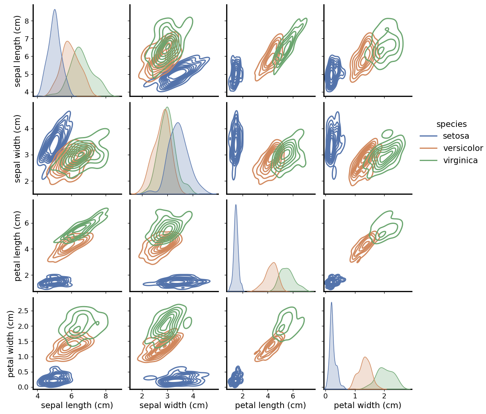

Hi, I'm Marta! I am a data science enthusiast with a background in Astrophysics and experience in analysing medical data. I’m passionate about using data to solve real-world problems and uncover insights. My goal is to leverage my skills in data analysis, machine learning, and data visualization to facilitate data-driven decisions that positively impact businesses and communities. I believe in the transformative power of data and am excited to contribute to innovative solutions across diverse fields.
# Data Science Projects

Welcome to My [Data Science Projects Repository](https://github.com/martasframos/Data-Projects)
In this repository, you will find a collection of projects that reflect my journey as a data scientist, bridging the gap between research in astrophysics and practical applications. Here I showcase a variety of **data science applications and analyses** that demonstrate my expertise in **data manipulation**, **visualization**, and **machine learning**.

## What You Will Find Here:
**PhD Projects in Astrophysics:**
Explore my academic research where I used advanced data analysis techniques to investigate the evolution of galaxies. These projects highlight my ability to handle large datasets, apply statistical methodologies, and develop algorithms tailored to specific research questions within the field of astrophysics.

**Real-World Data Projects:**
In addition to my academic endeavours, I have undertaken projects that utilise real-world datasets to demonstrate how the skills and techniques I acquired during my PhD can be applied to address practical challenges.

## Table of Contents
- [Spectra of MaNGA galaxies](#computing-annulus-regions-in-maNGA-galaxies)
- [Machine Learning to Predict Galaxy Gradients](#predicting-galaxy-gradients-with-machine-learning )
- [Analysis of the Iris Dataset](#data-analysis-report-on-the-iris-dataset)
- [Global Temperature Data Dashboard](#global-temperature-data-dashboard)

---
## Computing Annulus Regions in MaNGA Galaxies
Date: 05/2022
### 1. Introduction
The MaNGA (Mapping Nearby Galaxies at Apache Point Observatory) survey has provided spatially resolved data for over 10,000 galaxies as part of the fourth generation of the Sloan Digital Sky Survey (SDSS). This type of data offers valuable insights into the physical processes governing galaxy formation and evolution. The [MaNGA data analysis pipeline](https://www.sdss4.org/dr17/manga/manga-analysis-pipeline/) (DAP) offers 2-D maps of various galaxy properties, including Hα flux, D4000, and stellar velocity maps. The power of spatially resolved galaxy surveys lies in the ability to investigate different regions of the galaxy separately.

By analysing annulus regions within galaxies, astronomers can study variations in stellar populations, gas dynamics, and chemical enrichment across different parts of the galaxy.

#### 1.1 Goal of This Project
The main objective of this project is to create distinct annular regions within galaxies to facilitate the extraction of their spectral data. Spectroscopy is a vital tool in astronomy, providing critical information about galaxies, such as stellar mass, star formation rates, stellar ages, and metallicity.

To compute the radial profiles of galaxies, I first need to define and identify various annular regions around the galactic centre. This involves determining which spaxels (the spatial pixels in a spectroscopic data cube) fall within each of these annular regions. By accurately categorizing these spaxels, I can prepare for the systematic extraction of spectral data from each region in future analyses.

Here’s a brief overview of my approach:

- **Region Definition:** Establish clear criteria for defining the annular regions within the galaxy.
- **Spaxel Identification:** Develop algorithms to identify which spaxels lie within each of the defined annulus regions.

### 2. The Data

The data for this project will be sourced from the MaNGA public data release, specifically the SDSS DR17. The data is available in FITS format and can be downloaded from the [SDSS website](https://www.sdss4.org/dr17/manga/).

Each MaNGA datacube contains various properties that can be extracted, and the code presented here follows [this tutorial](https://www.sdss4.org/dr17/manga/manga-tutorials/how-do-i-look-at-my-data/python/) to obtain the necessary properties.

The galaxy used in this example has plateifu = 8548-12701 and its H-alpha map is shown below:

### Results

The code shown in [this notebook](./MaNGA_Annulus_region/Annulus_region_illustration.ipynb) creates several annular regions inside the galaxy map, with each of the regions encompassing a specific number of spaxels, counted only once. An illustration of these regions is presented below:

The creation of annular regions was successful, demonstrating the potential for spectral extraction and stacking. One challenge encountered was ensuring that the criteria for defining the annuli accurately reflected the galaxy's physical structure (i.e., taking size and axis ratio into consideration). However, through iterative refinement, the algorithm's accuracy was improved.

#### Technologies Used
- Python
- Pandas
- NumPy
- Astropy
- Matplotlib
- FITS (Flexible Image Transport System)

  
---
## Predicting Galaxy Gradients with Machine Learning 
Dat2 01/2024
### 1. Introduction

In this study, I analyse the stacked spectra of galaxies within defined annular regions. Using a spectral energy distribution (SED) fitting model, I derive critical astrophysical parameters such as stellar mass, specific star formation rate (sSFR), age, and metallicity. These parameters are then plotted as functions of the distance from the centre of the galaxy, with the property values represented on the y-axis and the distance to the centre in unites of `r/R_e` on the x-axis, where `R_e` denotes the effective radius of the galaxy.

This spatial analysis allows us to explore the distribution of sSFR gradients across different regions of galaxies. Subsequently, I apply machine learning techniques to investigate the relationships between these derived properties and other galaxy characteristics—including colour, Sérsic Index, and more—to identify which features are the most predictive of sSFR gradients.

### 2. Analysis 

The sSFR gradients are categorized into three distinct classes based on their slope characteristics:

**Negative Gradient:** Indicates a decrease in sSFR as the distance from the galaxy centre  increases.

**Shallow Gradient:** Represents a minimal change in sSFR across the annulus regions.

**Positive Gradient:** Suggests an increase in sSFR as one moves outward from the centre  of the galaxy.

To classify these gradients, I utilise **Random Forest Classification**, a robust ensemble learning method that excels at handling complex interactions between variables and is less prone to overfitting. This model enables us to assign galaxies to one of the three categories based on various predictive features, including colour and Sérsic Index.

**Feature Importance**
After training the model, I assess **feature importance** to identify which characteristics most significantly influence the classification of sSFR gradients. Understanding these predictive features is essential for gaining insights into the physical processes that govern star formation within galaxies.

**Model Evaluation**
I employ several metrics to evaluate the performance of our classification model:

**Confusion Matrix:** This matrix provides a detailed overview of the model's predictions, illustrating true positives, true negatives, false positives, and false negatives.

**ROC Curve:** The Receiver Operating Characteristic (ROC) curve depicts the balance between sensitivity (true positive rate) and specificity (false positive rate) across different threshold settings.

**Accuracy:** While accuracy serves as a general measure of model performance, it can sometimes be misleading in the context of imbalanced class distributions. Thus, I complement accuracy with the confusion matrix and ROC curve analysis to ensure a comprehensive evaluation.

Through this analysis, I aim to uncover the galaxy properties that are most predictive of sSFR gradients, contributing to our understanding of galaxy evolution and the underlying mechanisms of star formation.

### 3. Results

In [this notebook](https://github.com/martasframos/Data-Projects/blob/main/Galaxy_gradients/sSFR_gradients.ipynb), I provide the code used to train and fit the model on the dataset. I perform a **Grid Search Cross-Validation** with 5 folds to identify the best-fitting hyperparameters for the model.

**Hyperparameter Tuning**

The ranges explored for the hyperparameters are relatively small. This decision stems from preliminary analyses, which indicated that increasing the hyperparameter ranges yielded only marginal improvements in model performance (approximately +0.2 in accuracy). However, the computational time required for a broader search was significantly higher—over ten times greater than the current configuration.

**Rationale for a Smaller Grid Search**

Given the trade-off between computational efficiency and performance gains, I opted to conduct a more focused grid search. This approach ensures that the model training process remains efficient without sacrificing significant predictive performance. The results obtained from this smaller grid search will serve as a reliable foundation for understanding the model's behaviour and guiding future optimization efforts.

After fitting the model, the accuracy achieved was **0.65**. Below are additional performance evaluations that further illustrate the model's effectiveness.

**Confusion Matrix**

The confusion matrix provides valuable insight into the classification performance of the model. Overall, the majority of classes are correctly classified, with fewer than 40% of instances corresponding to misclassifications. This plot gives us a clear idea of how well the model is performing by visually representing the distribution of true positives, false positives, true negatives, and false negatives across all classes.

**ROC Curve**

The Receiver Operating Characteristic (ROC) curve is a graphical representation of the trade-off between sensitivity (true positive rate) and specificity (false positive rate) across various classification thresholds. It provides a comprehensive understanding of the model's ability to distinguish between classes. A well-performing model will have a curve that rises quickly towards the top-left corner, indicating high sensitivity with a low false positive rate.

In the plot below, the Area Under the Curve (AUC) for all classes exceeds 0.8, demonstrating that the model performs well across different thresholds. An AUC value closer to 1 indicates better model performance, as it reflects a strong ability to discriminate between positive and negative cases. A value above 0.8 suggests that the model achieves a good balance between identifying true positives and minimizing false positives.

Furthermore, the ROC curve and the corresponding AUC values highlight that the model has strong classification abilities, with minimal trade-offs between sensitivity and specificity across different thresholds.

**Feature Importance vs. Permutation Importance**

After training the model, I assess **feature importance** to identify which features most significantly influence the classification of sSFR gradients. Feature importance computed by the Random Forest model provides a direct insight into which features the model relies on during training. This method evaluates how much each feature decreases the weighted impurity (e.g., Gini impurity or entropy) at each split of a decision tree, averaged over all trees in the forest.

However, **permutation importance** offers an alternative approach that better captures the impact of each feature in a model-agnostic way. Rather than relying on the internal structure of the model, permutation importance measures the decrease in the model’s performance when the values of a feature are randomly shuffled, thereby breaking its relationship with the target variable. This method provides a more reliable and unbiased estimate of feature importance.

**Why Use Permutation Importance?**

**1- Captures Interactions:** Unlike the built-in feature importance in Random Forest, permutation importance can capture complex interactions between features by measuring how sensitive the model is to changes in each feature. It is a measure of how much the performance of the model (in this case the AUC) decrease when a feature is randomly shuffled. This means that permutation importance scores show the change in accuracy.

**2- Considers Overfitting:** Random Forest feature importance can sometimes be biased towards high-cardinality features, while permutation importance is less prone to such biases because it is directly tied to the performance of the model.

**4- Considers Testing Data:** Permutation importance is usually calculated on unseen testing data, which provides a better reflection of how features contribute to generalization rather than just model training.

**Drawbacks of Permutation Importance**

The main drawback in using permutaion importance is that it is sensitive to correlations between the features. If two features are highly correlated, permutation importance can underestimate their importance because shuffling one may not fully break its relationship with the target variable, the change in the performance of the model is very similar.

The feature importance score is shown bellow:

As shown in the notebook, the permutation importance shows a different ranking:
**Permutation Importance**

| Feature           | Importance Score |
|-------------------|------------------|
| sSFR              | 0.213            |
| Sérsic Index      | 0.066            |
| color_g_r         | 0.066            |
| color_g_i         | 0.035            |
| Re_kpc            | 0.032            |
| Mass              | 0.019            |
| Metallicity       | 0.019            |
| Redshift          | 0.012            |
| Log_surf_density  | 0.008            |

Here, sSFR, Sérsic Index and g-r colour being the top 3 features that are most predictive of the sSFR gradient. 

**Why trust permutation importance over feature importance?**

The core definition of permutation importance is a strong justification to choose it over feature importance. This is because it shows how much each feature directly contributes to the model's predictions, rather than only looking at how the model is constructed, like is the case when using feature importance. However, as I mentioned before, permutation importance is not a perfect method, as it is sensitive to highly correlated data.

### Conclusions
In this work, I concluded that the sSFR in the central region of the galaxy, together with its Sérsic Index and g-r colour are the features that play the most significant role in predicting the sSFR gradient in galaxies. This can help us shed a light into the processes that govern the evolution of galaxies

#### Technologies Used
- Python
- Pandas
- NumPy
- Seaborn
- scikit-learn
- Random Forest
- GridSearchCV
- Feature Importance Analysis
- Cross-Validation
  
---
## Data Analysis Report on the Iris Dataset
Date: 07/2024

### 1. Introduction
As I embarked on my journey into the world of data science during my Ph.D., one of my goals was to showcase how the analytical skills I have gained can be applied across different fields. A perfect opportunity to demonstrate this came with the Iris dataset, a classic in the fields of machine learning and statistics. This dataset contains 150 samples of iris flowers, characterised by four features: sepal length, sepal width, petal length, and petal width. Each flower belongs to one of three species: Setosa, Versicolor, or Virginica.

My motivation for analysing this dataset was twofold: to explore the relationships among its features and to showcase the data science techniques I’ve learned. I wanted to highlight how these skills can be applied effectively to solve practical problems. By working through this dataset, I aimed to demonstrate my grasp of various data science methodologies, including visualization and clustering. 

### 2 Data and analysis
The data used here is publicly available at the [UCI Machine Learning Repository](https://archive.ics.uci.edu/dataset/53/iris).

#### 2.1 Analysis
In this analysis, I performed the following steps:

**Data exploration and visualization** of feature relationships and species distribution.
**Clustering with K-Means** to uncover patterns and groupings within the data.
**Dimensionality reduction using PCAE** to visualize the data in 2D space.

The code for this can be found in [this notebook](https://github.com/martasframos/Data-Projects/blob/main/Iris_Dataset/Iris_dataset_analysis.ipynb)

##### 2.1.1. Data Exploration and Visualization:
A pairplot visualizes pairwise relationships between the features, colored by species. 

This graph allows us to: 

1- Observe the distributions and relationships of features against one another.

2- Identify potential clusters and separations among the three species based on feature measurements.

From the pairplot, it is evident that the Setosa species is distinctly separable from the other two species, especially in the petal length and petal width dimensions. For example, as we examine the scatter plots of petal length versus petal width, Setosa displays a clear clustering, indicating that these features can effectively differentiate this species from Versicolor and Virginica. On the other hand, Versicolor and Virginica show some overlap, particularly in the sepal dimensions.

Additionally, strong correlations are observable between certain features, notably between petal length and petal width, which can inform the development of classification models. The distribution plots along the diagonal reveal that petal length and petal width generally exhibit a wider range of values compared to sepal dimensions, which tend to cluster more closely.

##### 2.1.3. Correlation Heatmap

The next step of my analysis was to compute a correlation heatmap of the different features. This displays the correlation coefficients between different features.

In this plot, there is a strong positive correlation between petal length and petal width, with a correlation coefficient close to 1. This suggests that as the petal length increases, the petal width tends to increase as well, indicating a consistent growth pattern in these dimensions. The sepal length also shows a moderate positive correlation with petal length and width. This suggests that the size of the sepals may also provide some indication of the size of the petals, although the relationship is not as strong as that observed between petal dimensions. Finally, sepal width has a weaker correlation with other features, suggesting it may not be as influential in determining the species as the other measurements.

Understanding these correlations is vital as it informs our grasp of how features are interrelated, which can influence the choice of algorithms and models for prediction tasks. Features that are highly correlated may not provide additional information if included together in modelling, potentially leading to multicollinearity issues. This knowledge can guide feature selection, helping to build more efficient and interpretable models.

##### 2.1.3. Violin Plot
To showcase both plots, I have decided to investigate Petal length and sepal width in two different ways: using a violin plot fot he former (presented in this section) and a box plot for the latter (presented in the next section).

As a brief introduction to violin plots, these are a tool for visualizing the distribution of a dataset across different categories. Here, the width of the "violin" at different values represents the density (or frequency) of the data at that point. 

The above plot allows us to make the following interpretations:

**Setosa:** Petal lengths are concentrated around 1.5 cm. The distribution is tightly packed, which means that there is very little variation in petal length. The shape is quite narrow, indicating the data is highly concentrated around a single value.

**Versicolor:** Petal lengths show more variability, distributed mostly between 3 and 5 cm. The violin shape is broader in the middle, indicating that most petal lengths for this species are around 4-5 cm.

**Virginica:** Petal lengths for this species range from about 4.5 to 7 cm, with the largest spread among the species.
The plot is widest around 6 cm, indicating that most of the petal lengths are clustered around this value.

The violin plot shwon here is beneficial as it helps highlight the differences in distribution between species, indicating how well-defined the species categories are based on petal length.

##### 2.1.4. Box Plot
The box plot visualizes the distribution of sepal widths for each species. It highlights the median, quartiles, and potential outliers.

From the box plot shown above, it is clear that Setosa has the largest sepal widths compared to Versicolor and Virginica. This suggests that the measurements for Setosa are not only distinct in petal dimensions but also in sepal dimensions. In addition, the median sepal width observed for Versicolor is similar to that of Virginica, this is not surprising given the results presented in the pairplot. Finally, there are outliers in the Setosa and Virginica group, suggesting that some measurements fall outside the typical range.

##### 2.1.5.  KMeans Clustering

To explore the natural groupings within the dataset, I applied K-Means clustering with three clusters (representing the three species). The clustering was visualized through a scatter plot based on sepal length and sepal width, coloured by the cluster assignment.

A scatter plot visualizes the clusters based on sepal length and width. I evaluated the clustering using the silhouette score, which measured how well-separated the clusters were. The silhouette score for K-Means clustering was 0.55, indicating moderately well-defined clusters. 

The KMeans algorithm effectively distinguishes Setosa from Versicolor and Virginica. The clusters visually illustrate how well the algorithm has captured the underlying patterns in the data. Evaluating clustering performance with silhouette scores helps determine if the chosen number of clusters is appropriate and whether the data can be meaningfully categorized. This process informs future explorations, potentially guiding the selection of alternative clustering algorithms or adjusting the parameters of the KMeans algorithm for better results.

##### 2.1.6. PCA for Visualization
Next, I performed Principal Component Analysis (PCA) to reduce the dataset’s dimensionality and visualize it in a two-dimensional space. In short, PCA is a dimensionality reduction technique widely used in data analysis and machine learning. The goal of PCA is to simplify a dataset while preserving as much of the information as possible. It is particularly useful when dealing with high-dimensional data, where there are many variables or features. When applied to the Iris dataset, the PCA technique identified the two most important components that accounted for a significant portion of the variance in the dataset.

There is a clear separation between the three species, indicating that PCA has effectively captured the variance in the data while reducing its dimensionality. This separation aids in visually confirming the distinct groupings observed in previous analyses. Most of the variance in the dataset can be explained by the first two principal components, which simplifies understanding the data. This capability allows researchers to focus on the most informative dimensions without losing significant detail, making PCA a valuable tool for data exploration. This method provides a foundational understanding that can be built upon with more complex analyses or machine learning models.

##### 2.1.7. Pairwise Kernel Density Estimation (KDE)
The pairwise kernel density estimation (KDE) plot visualizes the distributions of feature pairs in the Iris dataset, providing insights into the relationships between features for different species. In short, a KDE plot visualises the probability density function (PDF), giving insight into where data points are most concentrated for each species.

The KDE plot shows a clear bimodal distribution in sepal length , indicating that Setosa (blue) and Versicolor (orange) have overlapping but distinct lengths. Virginica (green) has a higher peak at around 6-7 cm. The distribution shows that Setosa has a significantly higher average sepal width than the other two species. Versicolor and Virginica have more overlap, with both having a lower sepal width. This plot shows the same correlations as the simple pair plot presented in the begining ot this analysis with the added value of being able to see where the each species is more concentrated. As before, in the upper triangle of the plot, relationships between features become evident. There is a positive correlation between sepal length and both petal dimensions, with Setosa clearly separated from Versicolor and Virginica, which overlap more significantly. The KDE also shows that while sepal width and petal length have some correlation, it is weaker compared to other feature pairs. Overall, the plot illustrates that Setosa is well-separated from the other species, highlighting distinct morphological characteristics, while Versicolor and Virginica exhibit more similarity across several features. 

In summary, this project successfully demonstrated the power of data visualisation and clustering techniques in understanding species in the Iris dataset.

- **Technologies Used**:
  - Python
  - Pandas
  - NumPy
  - Seaborn
  - scikit-learn
  - KMeans
  - Principal Component Analysis (PCA)
  - t-SNE
  - Matplotlib

---
## Global Temperature Data Dashboard
Date: 09/2024
### 1. Project Overview
This project provides an interactive dashboard to visualize global temperature changes over time using data from the Global Land Temperatures dataset. The dashboard allows users to explore average yearly temperatures by country and observe changes in temperature over the years. 

#### 1.1 Project Features
This project includes:
- A choropleth map displaying average yearly temperatures by country.
- A choropleth map visualizing the change in average temperature over time.
- A line chart that shows the historical temperature trends for individual countries.

Built using **Dash** and **Plotly**, this dashboard facilitates interactive visualization of climate data, making it easier to track changes over time and across regions.

### 2. Project Purpose
The primary goal of this project is to create a visually appealing and informative dashboard that allows users to analyse temperature trends across different countries. It aims to highlight the impact of climate change by showcasing average temperature changes from the first recorded year to the most recent year.

#### Dataset
The project uses the Global Land Temperatures by Country dataset, which contains historical temperature data collected from various countries.

#### 3. Features
- **Interactive Dropdown**: Users can select a country to visualize its average temperature trends over the years.
- **Choropleth Maps**:
  - A map displaying the average yearly temperature for each country.
  - A map showing the change in average yearly temperature from the first to the last recorded year, with hover information that includes:
    - First and last year of data
    - Average temperatures for those years
- **Line Chart**: A line chart visualizing the temperature trend for the selected country.

The code is provided in [this notebook](https://github.com/martasframos/Data-Projects/blob/main/Data_visualisation_dashboard/Data_visualisation_dashboard.ipynb) and the outputs are presented below:

1- Dropdown menu to select which country to look at the average yearly temperature

2- The average temperature map with ability to hover over a desired country

3- The map showing the change in the average yearly temperature. Can also hover over any country.

#### Technologies Used
- Python
- Dash
- Plotly
- Pandas
- Jupyter Notebook (for development)
- HTML/CSS (for basic styling)

### Future Improvements
Incorporate additional data sources for more comprehensive analysis (e.g., CO2 emissions).
Add more interactive features, such as filtering by year range.
Enhance the design and usability of the dashboard.
Include options to download the displayed data or graphs.

